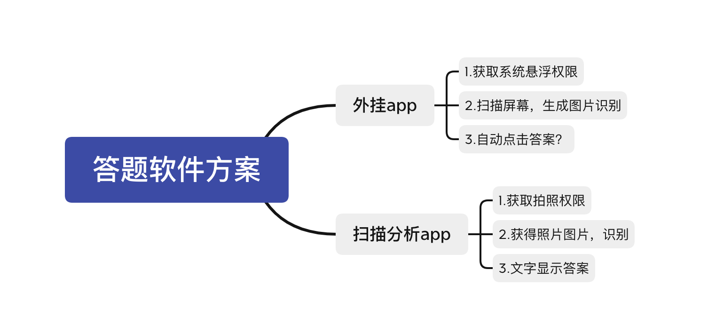
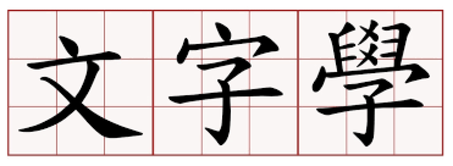
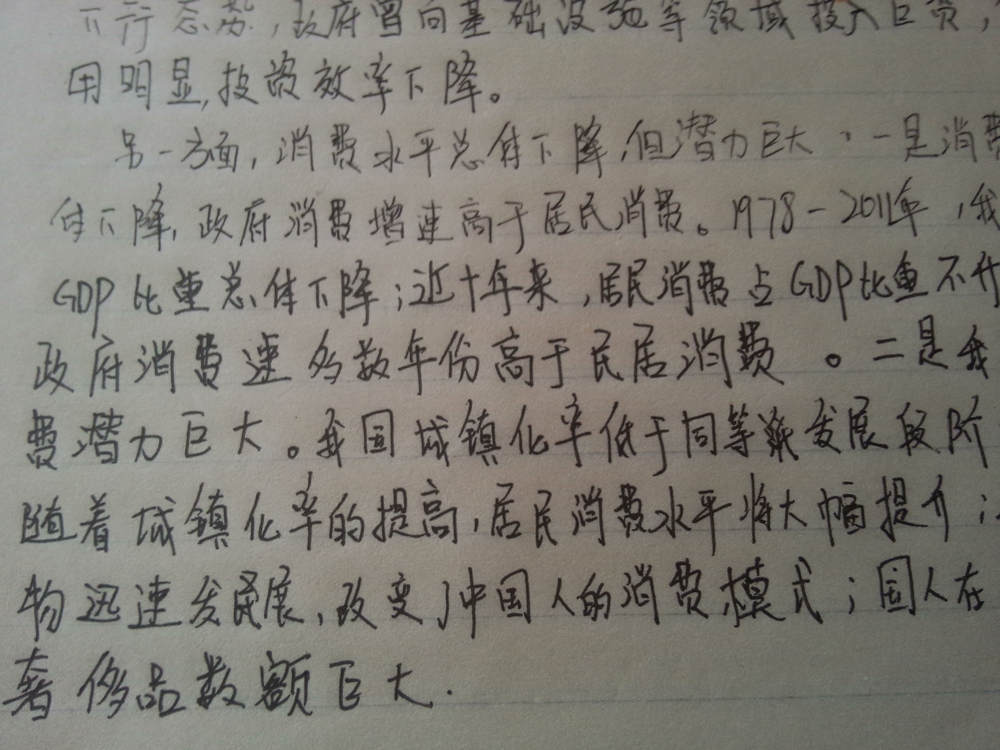

# 识别图片文字

最近朋友找到我，问能不能根据做一个根据题库自动得出答案的app出来，他提供题库和答案

啧，小case，先来个思维导图



本着先易后难的态度（实际上是懒）直接排除第一种方案

接着思考下第二种方案的可行性


#### 获取拍照权限好实现，一个input就搞定

```javascript
<input type='file' accept='image/*' capture='camera'/>
```

但如何识别图片中的文字内容

先问问google


根据关键字，我发现了一个可以实现图片文字识别功能的js库 - Tesseract.js


看下效果，好像还行，那么我们先写个Demo吧

```javascript
import React from 'react';
import Tesseract from 'tesseract.js';

export default class APP extends React.Component {
    constructor(props) {
        super(props);
        this.state = {
            message: '',
            result: '',
            loading: false,
        }
    }

    handleInputChange = (e) => {
        const file = e.target.files && e.target.files[0];
        this.setState({ result: '' });
        this.handleImageToTxt(file);
    }

    handleImageToTxt = (file) => {
        Tesseract.recognize(
            // 支持传文件/文件路径/base64编码等格式
            file,
            // 简体中文
            'chi_sim',
            { logger: m => this.setState({ loading: true, message: m.status }) }
        ).then(({ data: { text } }) => {
            const result = text.split(' ').join('');
            this.setState({ loading: false, message: '', result })
        })
    }

    render() {
        const { message, loading, result } = this.state;
        return <div style={{ fontSize: '80px' }}>
            <a>点击下方按钮拍照</a>
            <input
                style={{ fontSize: '50px' }}
                onChange={this.handleInputChange}
                type='file' accept='image/*' capture='camera'
            />
            {
                loading &&
                <div>
                    <span>加载中...</span>
                    <span>{message}</span>
                </div>
            }
            {
                result &&
                <div>
                    <span>结果：{result}</span>
                </div>
            }
        </div>
    }
}
```


所有支持语言在[这里](https://tesseract-ocr.github.io/tessdoc/Data-Files#data-files-for-version-400-november-29-2016)查看


效果好像还不错哦


加大难度试试




继续！




哈哈哈，看来是有点为难它了，但是基础功能我们还是成功实现了，鼓掌鼓掌

下一步就是开发一个全能识文app，接着升职加薪，赢取白富美，走上人生巅峰（醒醒，工头喊你起来搬砖啦🧱）


总之呢，由于识别率实在太低，本app宣布腹死胎中

要想提高识别率也有办法，Tesseract.js允许你自己训练文字库 - [操作导航](https://github.com/naptha/tesseract.js/blob/master/docs/faq.md)

等我朋友什么时候挣到钱来投我这个项目，本项目再继续启动吧

