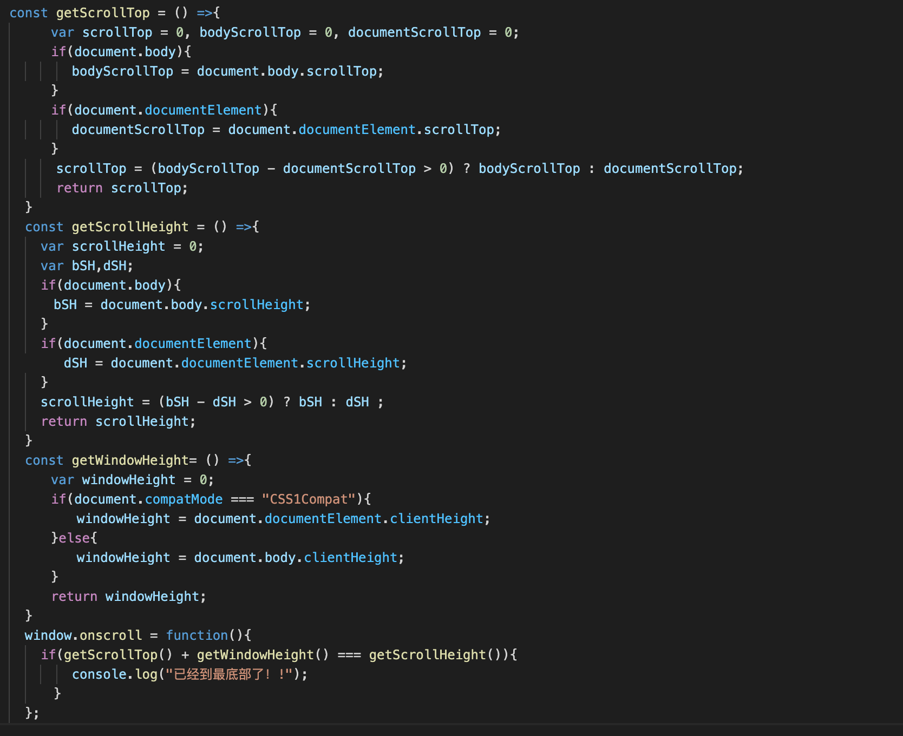

# 判断页面是否滑动到最底部

```javascript
const getScrollTop = () =>{
　　var scrollTop = 0, bodyScrollTop = 0, documentScrollTop = 0;
　　if(document.body){
　　　　bodyScrollTop = document.body.scrollTop;
　　}
　　if(document.documentElement){
　　　　documentScrollTop = document.documentElement.scrollTop;
　　}
    scrollTop = (bodyScrollTop - documentScrollTop > 0) ? bodyScrollTop : documentScrollTop;
    return scrollTop;
}
const getScrollHeight = () =>{
    var scrollHeight = 0;
    var bSH,dSH;
    if(document.body){
  　    bSH = document.body.scrollHeight;
    }
    if(document.documentElement){
　　　   dSH = document.documentElement.scrollHeight;
    }
    scrollHeight = (bSH - dSH > 0) ? bSH : dSH ;
    return scrollHeight;
}
const getWindowHeight= () =>{
　  var windowHeight = 0;
　　if(document.compatMode === "CSS1Compat"){
　　　　windowHeight = document.documentElement.clientHeight;
　　}else{
　　　　windowHeight = document.body.clientHeight;
　　}
　　return windowHeight;
}
window.onscroll = function(){
    if(getScrollTop() + getWindowHeight() === getScrollHeight()){
  	  console.log("已经到最底部了！!");  
    }
};
```





