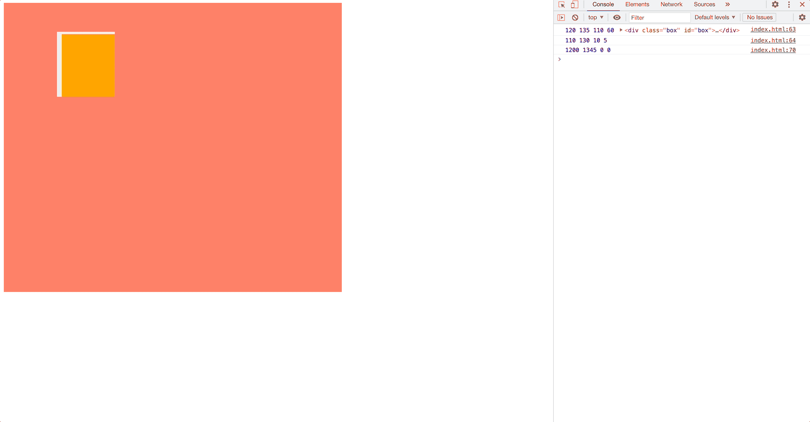

# JavaScript三大家族

介绍下著名的JavaScript三大家族

.png>)

哇哦，看的人头晕😵‍💫，还是自己写一个demo来试试效果吧

###

### Demo

```javascript
<body>
  <style>
    *{
      margin: 0;
      padding: 0;
    }
    body{
      padding: 10px;
    }
    .box {
      width: 500px;
      height: 500px;
      padding: 50px 100px;
      background-color: rgba(252, 62, 14, 0.678);
      position: relative;
    }

    .box1 {
      width: 100px;
      height: 100px;
      background-color: rgb(255, 166, 0);
    }
  </style>
  <div id="root">
    <div class="box" id='box'>
      <div class="box1" id='box1'></div>
    </div>
  </div>
</body>
```

.png>)

现在我们有了一个大box，以及里面的小盒子box1

###

### offset家族

先打印下所有的offset属性：

```javascript
<script>
  const box1 = document.getElementById('box1');
  console.log(
    box1.offsetWidth, 
    box1.offsetHeight, 
    box1.offsetLeft, 
    box1.offsetTop,
    box1.offsetParent, 
  );
</script>
```

.png>)

看看offset各个属性的定义：

* **offsetWidth**: 只读属性，返回一个元素的布局宽度，包括边框(border)、水平线上的内边距(padding)、竖直方向滚动条(scrollbar)（如果存在的话）、以及CSS设置的宽度(width)的值。
* **offsetHeight**：只读属性，返回一个元素的像素高度，包括元素的边框、内边距和元素的水平滚动条（如果存在且渲染的话），不包含:before或:after等伪类元素的高度。
* **offsetLeft**：只读属性，返回当前元素_左上角_相对于其 [`offsetParent`](https://developer.mozilla.org/zh-CN/docs/Web/API/HTMLElement/offsetParent) 节点的左边界偏移的像素值。
* **offsetTop**: 只读属性，它返回当前元素相对于其 [`offsetParent`](https://developer.mozilla.org/zh-CN/docs/Web/API/HTMLElement/offsetParent) 元素的顶部内边距的距离。
* **offsetParent**：只读属性，返回一个指向最近的（指包含层级上的最近）包含该元素的定位元素或者最近的 `table,td,th,body`元素。

offsetWidth、offsetHeight都好理解，主要说一下offsetParent、offsetLeft、offsetTop这三个属性

####

#### offsetParent

重点介绍offsetParent，根据[MDN](https://developer.mozilla.org/zh-CN/docs/Web/API/HTMLElement/offsetParent)上的说法：

> **`HTMLElement.offsetParent`** 是一个只读属性，返回一个指向最近的（指包含层级上的最近）包含该元素的定位元素或者最近的 `table,td,th,body`元素。当元素的 `style.display` 设置为 "none" 时，`offsetParent` 返回 `null`。`offsetParent` 很有用，因为 [`offsetTop`](https://developer.mozilla.org/zh-CN/docs/Web/API/HTMLElement/offsetTop) 和 [`offsetLeft`](https://developer.mozilla.org/zh-CN/docs/Web/API/HTMLElement/offsetLeft) 都是相对于其内边距边界的。

offsetParent我们根据字面意思能知道，它是满足一定条件的当前元素的父组件

找寻条件是：包含当前元素的**定位元素**（设置了定位属性`position`的元素**）**，或者最近的 `table, td, th, body` 元素。

根据以上定义还是很好理解offsetParent的含义的，大家只需要稍微注意一点就行：

**如果当前元素的position为fixed，那么它的offsetParent为null**

（当前元素 ： box1）

```javascript
.box1 {
    width: 100px;
    height: 100px;
    background-color: rgb(255, 166, 0);
    border: 10px solid #eee;
    position: fixed;
}
```

.png>)

.png>)

### ****

* **offsetLeft**：只读属性，返回当前元素_左上角_相对于其 [`offsetParent`](https://developer.mozilla.org/zh-CN/docs/Web/API/HTMLElement/offsetParent) 节点的左边界偏移的像素值。
* **offsetTop**: 只读属性，它返回当前元素相对于其 [`offsetParent`](https://developer.mozilla.org/zh-CN/docs/Web/API/HTMLElement/offsetParent) 元素的顶部内边距的距离。

再看下它俩的定义，要找到它俩，关键其实就在于要找到当前元素的offsetParent是谁

当我们找到offsetParent后，offsetLeft、offsetTop也就出来了


### client家族

稍微改下box1的样式

```javascript
.box1 {
    width: 100px;
    height: 120px;
    padding: 5px;
    margin: 10px;
    border: 10px solid #eee;
    background-color: rgb(255, 166, 0);
}
```

打印下box1的client家族属性：

```javascript
console.log(
    box1.clientWidth, 
    box1.clientHeight, 
    box1.clientLeft, 
    box1.clientTop,
);
```

.png>)

**client各个属性的定义：**

* **clientHeight**：只读属性，对于没有定义CSS或者内联布局盒子的元素为0，否则，它是元素内部的高度(单位像素)，包含内边距，但不包括水平滚动条、边框和外边距。
* **clientWidth：** 内联元素以及没有 CSS 样式的元素的 `clientWidth` 属性值为 0。`clientWidth` 属性表示元素的内部宽度，以像素计。该属性包括内边距 padding，但不包括边框 border、外边距 margin 和垂直滚动条（如果有的话）。
* **clientTop：** 只读元素，一个元素顶部边框的宽度（以像素表示）。不包括顶部外边距或内边距。
* **clientLeft：** 表示一个元素的左边框的宽度，以像素表示。如果元素的文本方向是从右向左（RTL, right-to-left），并且由于内容溢出导致左边出现了一个垂直滚动条，则该属性包括滚动条的宽度。`clientLeft` 不包括左外边距和左内边距。

也就是说clientWidth与clientHeight都是代表当前元素content+padding的长度

.png>)

clientLeft、clientTop这两个属性，经过测试我发现，它俩其实就是border

```javascript
.box1{
    border-left: 10px solid #eee;
    border-top: 5px solid #eee;
}
```

.png>)

.png>)


### scroll家族

scroll各个属性的定义：

* **scrollWidth：** 只读属性。一个元素内容宽度的度量，包括由于溢出导致的视图中不可见内容(不包括滚动条和border)。
* **scrollHeight：**只读属性。一个元素内容高度的度量，包括由于溢出导致的视图中不可见内容(不包括滚动条和border)。
* **scrollTop：** 读取元素滚动条到元素顶部的距离(不包括滚动条和border)
* **scrollLeft：** 读取元素滚动条到元素左边的距离(不包括滚动条和border)

scroll家族不包含滚动条，offset家族包含滚动条

```javascript
console.log(
  box1.scrollWidth,
  box1.scrollHeight,
  box1.scrollLeft,
  box1.scrollTop,
);
```

.png>)

这么看着好像不太明显，我们新定义一个box2

```javascript
<style>
  .box {
    width: 500px;
    height: 500px;
    padding: 50px 100px;
    background-color: rgba(252, 62, 14, 0.678);
    position: relative;
  }
  .box2 {
    width: 100px;
    height: 100px;
    margin-left: 600px;
    background-color: rgb(255, 38, 0);
  }
</style>

<div class="box" id='box'>
  <div class="box1" id='box1'></div>
  <div class="box2" id='box2'></div>
</div>

<script>
  console.log(
    box.scrollWidth,
    box.scrollHeight,
    box.scrollLeft,
    box.scrollTop,
  );
</script>
```

.png>)

.png>)

可以看到，打印的box的scrollWith为800

800是怎么来的？ \
1.box的宽度为500\
2.box2的margin-left为600，撑开了box的宽度，所以box实际content宽度为600\
3.**scrollWidth** = content宽度 + padding\*2 = 600+100\*2 = 800

**scrollHeight**也是一样的计算方法

接下来看下**scrollTop**、**scrollLeft**，首先改造下代码

```javascript
<style>
  .box2 {
      width: 100px;
      height: 100px;
      margin-top: 1000px;
      margin-left: 1000px;
      background-color: rgb(255, 38, 0);
  }
</style>
<script>
  box.addEventListener('scroll', function () {
    console.log(
      box.scrollLeft,
      box.scrollTop,
    );
  })
</script>
```

看下效果



&#x20;   即设置scrollLeft就如同你拖动水平滚动条一样。假如你的页面太大，浏览器的宽度不够，就会出现滚动条。一开始scrollLeft的值为0，你就看到了你的页面最左边的内容，而不显示超过浏览器的那部分。\
&#x20;   当你向右拖动滚动条时，scrollLeft的值在增大，你就看到了右边因隐藏的东西，而看不到左边隐藏的部分。他就会从scrollLeft的位置开始显示，而不显示0-scrollLeft的元素内容。


### 其他相关属性：

网页可见区域宽： document.body.clientWidth;\
网页可见区域高： document.body.clientHeight;\
网页可见区域宽： document.body.offsetWidth   (包括边线的宽);\
网页可见区域高： document.body.offsetHeight (包括边线的宽);\
网页正文全文宽： document.body.scrollWidth;\
网页正文全文高： document.body.scrollHeight;\
网页被卷去的高： document.body.scrollTop;\
网页被卷去的左： document.body.scrollLeft;\
网页正文部分上： window.screenTop;\
网页正文部分左： window.screenLeft;\
屏幕分辨率的高： window.screen.height;\
屏幕分辨率的宽： window.screen.width;\
屏幕可用工作区高度： window.screen.availHeight;\
屏幕可用工作区宽度：window.screen.availWidth;\
\
event.clientX 相对文档的水平座标 \
event.clientY 相对文档的垂直座标 \
event.offsetX 相对容器的水平坐标 \
event.offsetY 相对容器的垂直坐标 \
document.documentElement.scrollTop 垂直方向滚动的值 \
event.clientX+document.documentElement.scrollTop 相对文档的水平座标+垂直方向滚动的量

